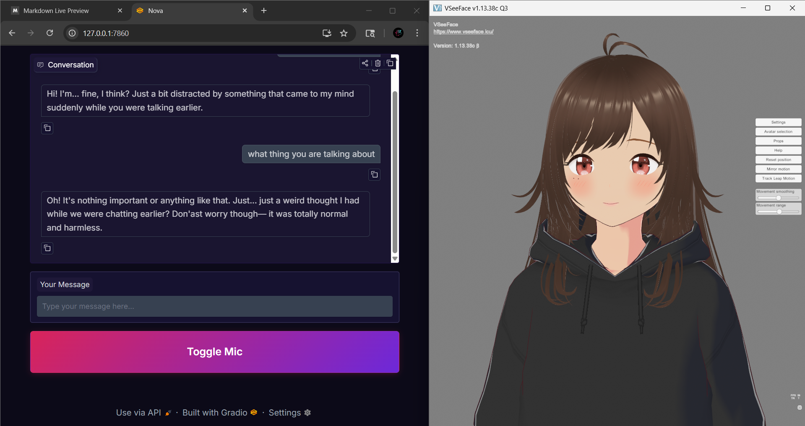

Forked from [Navjot-Singh7/Project-Nova](https://github.com/Navjot-Singh7/Project-Nova)
---

# 🌸 Project Nova

## A Fully Local AI Companion with Memory, Emotion, Voice, Avatar Control, and Agentic Abilities

**Project Nova** is a fully local, real-time AI companion designed to feel persistent, emotionally aware, and interactive.  
It combines a fine-tuned large language model, long-term memory, expressive text-to-speech, speech recognition, and live 3D avatar control — all optimized to run on consumer hardware.
---

---
>### 🔔 Updates
>### v0.5 — Nova Web UI update (Latest)
> - A simple, clean web interface for **Nova** - your local AI companion.
> ### Features
> - Run web_ui.py if you want to use Web UI, otherwise run main.py if you want to use Nova via Terminal
> - **Text Chat**  - Type your messages
> - **Voice Input** - Toggle mic button , speak naturally
> - **Real Time Responses** - Nova replies with emotion and memory
> ### Usage
> - Type a message and press Enter
> - Click the Mic button to speak (press again to stop)
> - Nova responds - conversation continues
> ### Tech Stack
> - Gradio (Web UI)
> - Python (backend Logic) 
>### v0.4 — Nova Vision update (Latest)
> - Nova's vision capabilities have been upgraded from simple webcam support to full Environment Awareness. She can now also see your screen.
> - New **Look** Capabilities:
>   - **Contextual Screen Capture:** Nova doesn't waste resources by recording. Instead, she captures a snapshot only when you ask: "Nova, checkout my screen!" or "What's on my screen?.
>   - **Dual-Source Input:** Seamlessly switch between the Webcam (to see your face/emotions) and the Screen (to see your games, code, or art).
>   - **Hardware Optimized:** Designed to run alongside high-end games without causing FPS drops.
>
>### v0.3 — Nova V2
> - Nova's model has been completely re-trained from the ground up to be more stable, expressive, and structurally sound.
> - While V1 was successfully fine-tuned to repond in JSON format, it required a System Prompt to guide the model for that behavior. V2 has been deeply trained (455 steps, 0.39 loss) to make JSON and the personality its native language. It now understands the JSON structure at a foundational level, making it more **'alive,'** and **'emotionally expressive'**.
> - **Download** the new version from Huggingface - https://huggingface.co/Navpy/phi-3.5-AI-Vtuber-json
> - For **Ollama** users use the Modelfile which is inside **assistant_modelfile/** folder to get the best results out of the model **(RECOMMENDED)**.
>
>
>### v0.2 — Multimodal Capabilities (Project Nova Vision)
>- Project Nova is now a **Multimodal AI Agent**. Using a custom-engineered pipeline, Nova can "see" her environment and react in real-time while maintaining her 3D persona.
>
>
>### 🛠️ Technical Architecture
>- To fit a vision-language model (VLM) alongside a fine-tuned LLM on a limited **4GB RTX 2050**, I implemented a **Sequential Model Offloading** strategy:
>
> 1. **Intent Trigger:** A keyword-based heuristic (e.g., "Look at this") triggers the vision sequence.
> 2. **Resource Swapping:** To prevent OOM (Out of Memory) crashes, the system dynamically swaps models between System RAM and GPU VRAM.
> 3. **Visual Injection:** The resulting image description is injected into Nova's context as **Internal Sensory Data**, allowing her to react naturally without breaking character.
>
>#### Models Used
>- **Vision:** `SmolVLM-256M` (Quantized for edge-level performance).
>
>
>### v0.1 — Discord Integration
>- Added **Discord bot support** to chat with Nova remotely
>- Uses the same **LLM, memory, and personality** system
>- Secure token handling via **`.env`** (not committed)
>- Can run alongside the **local voice/avatar version**
- #### Scroll below to see the instructions for setting up Nova as a Discord Bot. 
---
> ⚠️ **Development Disclaimer**
>
> Project Nova was **not created using “vibe coding” or fully AI-generated code**.
>
> The system architecture, core logic, threading model, memory design, agentic behavior, and debugging were **designed, implemented, and validated manually**.
> 
>Time Taken for development (approx 2 months)
>
> AI tools were used **only as a support resource** for:
> - Understanding unfamiliar concepts (eg. Threading, RAG)
> - Exploring alternative approaches (eg. Chunking, Streaming TTS)
> - Identifying potential issues
>
> When automated suggestions failed or were incorrect, **all debugging, fixes, and final decisions were performed manually**.
>
> This project reflects hands-on engineering, iterative testing, and deliberate system design — not prompt-to-project generation.


## ✨ Core Features

### 🧠 Long-Term Memory (RAG-Based)

- Persistent memory powered by **ChromaDB**
- Semantic embeddings enable **retrieval-augmented generation (RAG)**
- Supports:
  - Explicit memories (user asks Nova to remember)
  - Episodic / emotional memories
  - Contextual recall during conversation
- Latest memories are injected at startup to maintain continuity across sessions

> Memory is semantic, persistent, and local — no hard-coded state.

---

 ### 🤖 Language Model (LLM)

- Uses a **Phi-3.5 fine-tuned model**  (4B parameters, Q4_K_M quantization)
- Fine-tuned on a **custom conversational dataset using Google Collab**
- Optimized for
  - Structured JSON output
  - Consistent personality
  - Low-latency local inference
- Runs locally via [Ollama](https://ollama.com)
- Enforced **structured JSON output**:
- Model is available at [Hugging Face](https://huggingface.co/Navpy/phi-3.5-AI-Vtuber-json)

```json
{
  "response": "text",
  "emotion": "emotion_name"
}
```

- Low-latency
- VRAM-efficient
- Optimized for real-time interaction
---
### 🗣️ Speech-to-Text (STT)
- Powered by Faster-Whisper
- Fully local and offline transcription
- Real-time microphone input
- Optimized for low latency and accuracy
---
### 🔊 Text-to-Speech (TTS) Architecture
Nova’s TTS system is designed for low latency, emotional expressiveness, and smooth playback — even on limited VRAM.
### 🧩 TTS Model
- Soprano-TTS (80M param, lightweight, local)
- GPU-accelerated using CUDA
- Emotion-aware generation via controlled parameters:
    - temperature
    - top_p
    - repetition_penalty
### 🧠 Text Processing
Output text is cleaned to remove patterns that commonly cause hallucinations or unstable TTS output:
- Ellipses (..., ……)
- Stutters (I...I'll)
- Excess punctuation
- Newlines and malformed tokens
### ⚙️ Chunking + Streaming System (Producer–Consumer)
Nova does not generate and play audio in a blocking way. Instead, she uses a producer–consumer threading architecture.
1. **Chunking** : Response text is split into natural sentence chunks to prevent long generations and enable early playback.
2. **Producer Thread (Audio Generation)** : Generates audio chunks sequentially and pushes them into a shared queue.
3. **Consumer Thread (Audio Streaming)** : Continuously reads from the queue and streams to the output device. Playback begins before full generation completes.
#### ✅ Results: Low perceived latency, natural pauses, and stable audio.
---
### 🎭 Emotional Expression System
Each LLM response includes an emotion tag that controls:
- 🎙️ Voice generation parameters
- 🧍 Facial expressions
- 🕺 Idle animations
#### **Behavior** : Emotion is applied at speech start and automatically released when playback ends.
---
### 🧍 3D Avatar Control (VMC Protocol)
- Uses **VMC / VSeeFace** protocol
- Sends real-time data for:
    - Facial expressions
    - Head movement
    - Emotional states
- Avatar reacts synchronously with voice and emotion
---
### 🎧 Audio Routing & Lip-Sync
- Audio output routed through **Virtual Audio Cable**
- VSeeFace uses the virtual cable as microphone **input**
- Enables accurate **real-time lip-sync**
---
### 🕒 Time Awareness
- Natural language date & time awareness
- Conversations and memories are timestamped
- Nova can reference time contextually
---
### 🤖 Agentic Abilities
**Nova can perform real system actions based on user intent:**
- 🎵 Play songs on YouTube (via songs.json)
- 🌐 Open websites (Google, YouTube, etc.)
- 🗂️ Perform basic file operations
- 🧠 Decide when to act vs respond conversationally
> ⚠️ Some agentic actions (e.g., file operations) are intentionally limited and rule-based to prevent unintended behavior.
#### **All agentic logic is:** Fully local, rule-based, and explicitly triggered.
---
### 🧠 System Architecture
```
User
 ↓
Speech-to-Text (Faster-Whisper)
 ↓
Phi-3.5 Fine-Tuned LLM (Ollama)
 ↓
┌───────────────┐
│ Memory System │ ← ChromaDB (RAG)
└───────────────┘
 ↓
Structured JSON Output
 ↓
┌──────────┬────────────┬──────────┐
│   TTS    │  Avatar    │ Agentic  │
│ (Chunks) │ (VMC)      │ Actions  │
└──────────┴────────────┴──────────┘
 ↓
Audio → Virtual Audio Cable → VSeeFace
```
---
## 💻 System Requirements
### Hardware
- **NVIDIA GPU:** (4–6 GB VRAM minimum)
## 🧪 Development & Minimum Hardware Target

Project Nova was **designed, developed, tested, and optimized** on the following hardware:

- **GPU:** NVIDIA RTX 2050  
- **VRAM:** 4 GB  
- **CUDA:** Enabled  
- **Platform:** Windows

This configuration represents the **minimum recommended hardware** to run Project Nova smoothly with:

- Local LLM inference (Phi-3.5 fine-tuned, quantized)
- GPU-accelerated TTS
- Real-time speech recognition
- Avatar control via VMC
- Concurrent agentic features

All architectural decisions — including **model selection, quantization, chunked TTS streaming, and producer–consumer threading** — were made specifically to ensure stable performance within a **4 GB VRAM constraint**.

> If the project runs reliably on this system, it is expected to scale better on higher-end GPUs.

### Software
- Windows (recommended)
- [Ollama](https://ollama.com/)
- [Python 3.11.0](https://www.python.org/downloads/release/python-3110/) (recommended)
- [CUDA Toolkit: (12.x or newer)](https://developer.nvidia.com/cuda-downloads)
- NVIDIA Drivers
- [VSeeFace](https://www.vseeface.icu/#download)
- [Virtual Audio Cable **(VAC)**](https://vb-audio.com/Cable/)
---
## 📦 Installation
### 1️⃣ Clone Repository
```bash
git clone https://github.com/Navjot-Singh7/Project-Nova.git
cd Project-Nova
```
### 2️⃣ Create Virtual Environment
```bash
py -3.11 -m venv my_env

my_env\Scripts\activate
```
### 3️⃣ Install Dependencies
```bash
pip install -r requirements.txt
```
### 4️⃣ Install PyTorch (Required)
#### Example for NVIDIA GPU (CUDA 12.6):
```bash
pip install torch==2.6.0 torchvision==0.21.0 torchaudio==2.6.0 --index-url https://download.pytorch.org/whl/cu126
```
### 5️⃣ Install Model directly from HuggingFace to your downloads folder (Recommended)
https://huggingface.co/Navpy/phi-3.5-AI-Vtuber-json/tree/main
### 6️⃣ Fix Modelfile for your system
***Note*** - Copy the path where your model is downloaded and paste it in the Modelfile which is inside **assistant_modelfile/** folder
```bash
# make sure it is inside quotes
FROM "<YOUR_MODEL_FILE_PATH>"
```
### 7️⃣ Create the Model - open your terminal in the Project-Nova folder and run this command
```bash
# Make sure you have ollama installed in your computer
ollama create nova -f assistant_modelfile/Modelfile
```
### 8️⃣ Check if the model is created or not
**Note** - You'll see your model name in the terminal
```bash
ollama list
```
### 9️⃣ Install Text Embedding model - this model is used for Retrieval Augmented Generation (RAG)
```bash
ollama pull nomic-embed-text
```
### 🔟 Run the main Script normally
```bash
python main.py
```
#### By default, Project Nova runs in **online mode** to allow automatic downloading of required models (STT, TTS).Once all models are downloaded, you can run Nova fully offline, By setting these environment variables at the top of your code in (***main.py***) and (***web_ui.py***) file before importing anything.
```bash
import os
# Set offline mode BEFORE any other imports
os.environ["HF_HUB_OFFLINE"] = "1"
os.environ["HF_DATASETS_OFFLINE"] = "1"
os.environ["TRANSFORMERS_OFFLINE"] = "1"
os.environ["HF_HUB_DISABLE_TELEMETRY"] = "1"
os.environ["HF_HUB_ENABLE_HF_TRANSFER"] = "0"
```
---
### 🎙️ Audio Setup
1. Install a **Virtual Audio Cable**.
2. Set Nova’s output device to the virtual cable.
3. Set **VSeeFace** microphone input to the same virtual cable.
#### Then press window+r on your keyboard and follow these instructions so that lip syncing will work
- Type "mmsys.cpl"
- Go to **Recording tab**
- You'll see **CABLE OUTPUT** go to it's properties
- Go to **Listen tab**
- Select **"Listen to this device"** and choose your default output deivce
- Press **Apply**
- Now your lipsync will work
---
### 🧠 Memory Storage
Stored locally in:
```waifu_memories/```
- Persistent across sessions
- Ignored by Git
- Auto-created if missing
---
### 🔐 Privacy & Offline Use
- **Fully local:** No cloud APIs.
- **Works offline:** After models are downloaded.
- **Privacy:** No Data is sent to any cloud servers
---

## 💬 Discord Integration (Optional)

Project Nova can also be accessed via a **Discord bot interface**, allowing you to chat with Nova remotely while preserving her personality and memory system.

### Features
- Text-based conversation with Nova on Discord
- Uses the **same LLM and memory system** as the local companion
- Supports long-term memory and contextual responses
- Can run alongside the local voice/avatar version or independently

> The Discord bot is an optional interface.  
> Nova’s core intelligence remains fully local.
---
### 🛠️ Discord Bot Setup

1. Create a Discord application:
   - Go to https://discord.com/developers/applications
   - Create a new application
   - Add a **Bot** and copy the bot token

2. Create a `.env` file in the project root:
```bash
DISCORD_BOT_TOKEN="<your_bot_token_here>"
```
3. Invite the bot to your server using the OAuth2 URL from the Developer Portal.
4. Install Discord dependencies
```
pip install discord.py python-dotenv
```
5. Run the Discord bot script
```
python bot.py
```

### ⚠️ Disclaimer
Project Nova is an experimental AI companion project intended for:
- Learning
- Research
- Personal use
#### It is not a **substitute** for professional or emotional support.
---
> Project Nova is designed to explore how far a **fully local, persistent, emotionally-aware AI companion** can go — without cloud dependence.
---
## ❤️ Credits
- Ollama
- Soprano TTS - https://github.com/ekwek1/soprano
- ChromaDB
- Faster-Whisper
- VSeeFace
- Open-source AI community
---
## 📄 License
This project is licensed under the **MIT License**.  
You are free to use, modify, and distribute this project for personal or educational purposes.

---
⭐ If you like this project, please give it a star!
---
